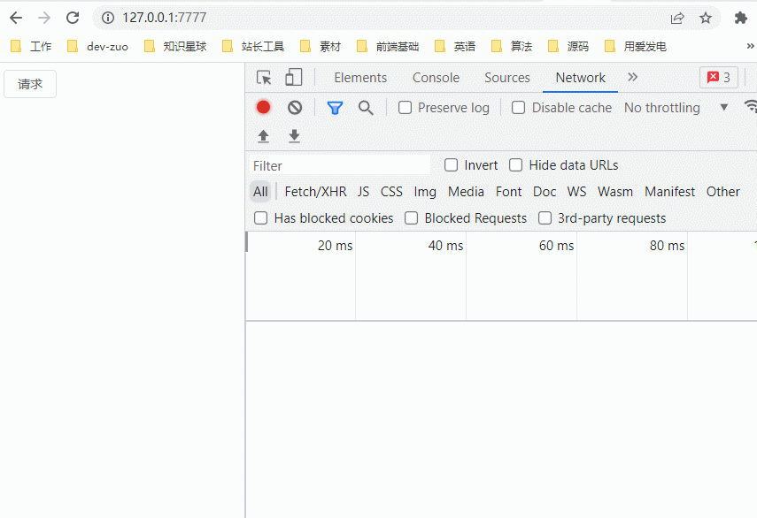

# 循环调用接口 loopRequest

运行

```bash
# 安装依赖，node 版本 v16.17.1
npm install 
# 运行服务
node ./server/index.js
```

打开 [http://127.0.0.1:7777](http://127.0.0.1:7777) 即可测试效果

逻辑：

- 点击请求（接口初始值状态为 pending，4s 后改为 fail ）

注意点：

- 修改 server/index.js 调试时，需要重新运行服务才能生效
- 运行一次后，状态会变更为非 pending，除非关闭服务后，再执行 node ./server/index.js 重新运行服务



## 目录

```bash
- fe
  - index.html   # 前端页面，访问 http://127.0.0.1:7777 进入的页面
  - v2.ts # setInterval 方式 ts，不推荐，接口时延
  - v2.js # setInterval 方式 ts，需要维护 setInterval 状态代码较多
  - v3.js # 推荐，简化版，仅在接收到响应后， 状态为 pending 再请求接口，超时或获取状态成功退出
- server
  - index.js # koa 接口服务，用于测试
```

接口处理逻辑基于以下响应数据格式

```js
{
    code: 0, // 后端业务状态 0 成功，非 0(比如 -1)，业务异常
    data: { // 成功后状态值
        state,
        // state: "success",
        // state: 'fail',
        // state: 'pending'
    },
    msg: "ok", // 成功后内容为 "ok"， 失败为具体业务逻辑报错信息
    // msg: res, // 人工制造错误
};
```

## 关于取消请求问题

取消请求可以，但会增加逻辑复杂度。不建议把前端逻辑做复杂，能简单就简单，太复杂了会不好维护，不要坑后面维护的同事，能早下班就早下班。

## 后续完善

现在接口是固定的，可以把接口做成参数
