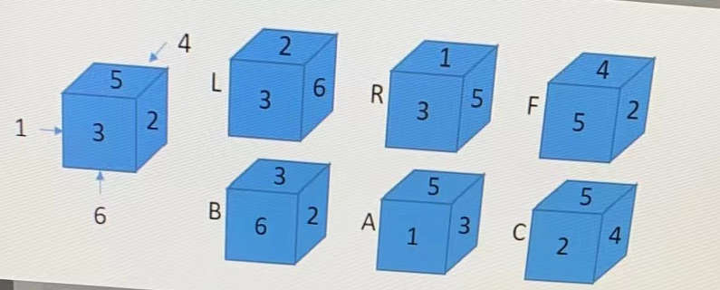

# 骰子翻转

## 题目描述

骰子是一个立方体，每个面一个数字，初始为左1 右2 前3 （观察者方向） 后4 上5 下6

用 1 2 3 4 5 6表示这个状态 放置在平面上 可以向左翻转（用L表示向左翻转一次）

可以向右翻转（用R表示向右翻转一次） 可以向前翻转（用F表示向前翻转一次）

可以向后翻转（用B表示向后翻转一次）可以逆时针旋转（用A表示逆时针旋转90度）

可以顺时针旋转（用C表示顺时针旋转90度）

现在从123456这个初始状态开始 根据输入的动作序列 计算最终的状态

### 输入描述

输入一行 为只包含LRFBAC的字母序列 最大长度50 字母可以重复

### 输出描述

输出最终状态

## 示例1

输入 LB

输出 5 6 1 2 3 4

说明 骰子先向左翻转，在想后翻转，那么此时的状态561234

## 示例2

输入 LR

输出 1 2 3 4 5 6

说明 骰子先向左翻转，在想右翻转回到了原始状态，那么此时的状态123456

## 示例3

输入 FCR

输出 3 4 2 1 5 6

说明 ：

骰子先向前翻转，状态变为125643

再向顺时针旋转回90度，状态变成为562143

再向右翻转，状态就变成为342156

## 相关链接

- [【算法题】转骰子问题](https://www.peiluming.com/article/62)
