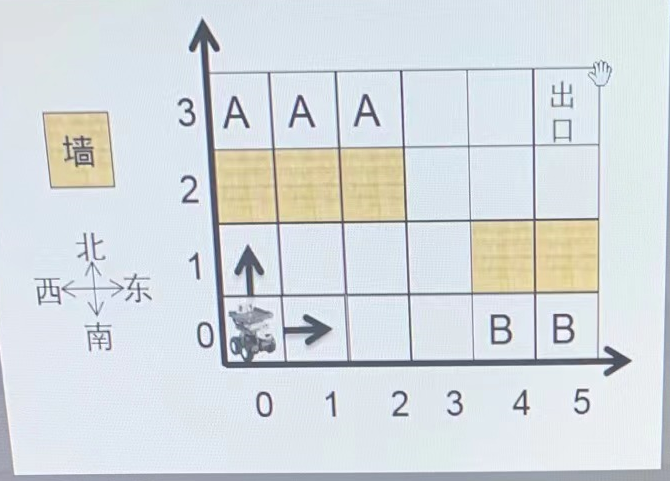

# 机器人走迷宫

## 题目描述

1，房间由 X\*Y 的方格组成，6\*4 的大小。每一个方格以坐标（x,y）描述。
2，机器人固定从方格（0，0）出发，只能向东或者向北前进。出口固定为房间的最东北角，如下图的方格（5，3）.用力保证机器人可以从入口走到出口。
3，房间有些方格是墙壁，如（4，1），机器人不能经过哪儿。
4，有些地方是一旦到达就无法走到出口的，如标记为B的方格，称之为陷阱方格。有些地方是机器人无法到达的，如标记为A的方格，称之为不可达方格，不可达方格不包括墙壁所在的位置。
6，如图中 陷阱方格有 2 个 不可达方格有 3 个。
7，请为该机器人实现路径规划功能：给定房间大小，墙壁位置，请计算出陷阱方格与不可达方格分别有多少个



### 输入描述

1，第一行为房间的 X 跟 Y `（0<X,Y<=1000）`
2, 第二行为房间中的墙壁的个数 N `（0<=N<X*Y）`
3, 接着下面会有N行墙壁的坐标同一行中如果有多个数据以一个空格隔开，用例保证所有数据合法（结尾不带回车换行）

### 输出描述

1，陷阱方格与不可达方格数量，两个信息在一行中输出，以一个空格隔开

## 示例

输入

```bash
6 4
5
0 2
1 2
2 2
4 1
5 1
```

输出

```bash
2 3
```
